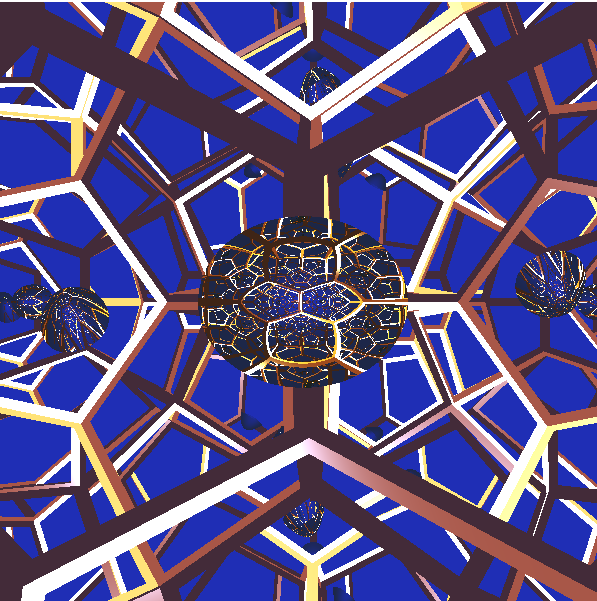

# Ray-tracing dodekaéderben

A program lényege egy virtuális környezet létrehozása, melyben egy félbevágott mirascope helyezkedik el, melyben visszatükröződnek a világ elemei. 

A dodekaéder tükör falakkal rendelkezik, illetve minden falban 5-szörösen tükrözödik vissza minden, azt a hatást keltve, mintha többszörös dimenzió kapuk lennének. 

Minden tükrözött elem a falakban elfordul egy megadott szöggel. 

Minden építőelem megadott tulajdonsággal rendelkezik, illetve a tükröződés is lehet arany vagy ezüstös. 

A virtuális kamera forog a mirascope körül.

https://user-images.githubusercontent.com/90961659/175056967-09f60920-1f86-420b-b1e8-345d532744a4.mp4

