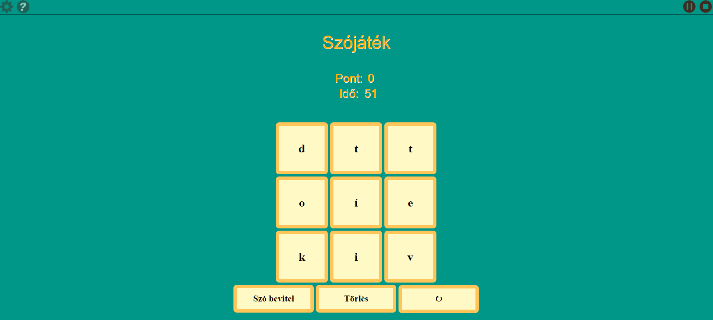
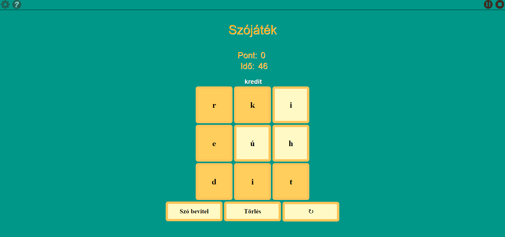
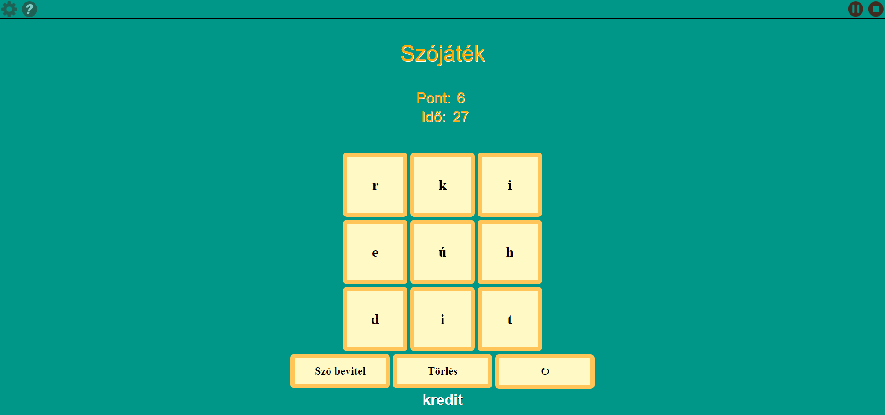

# SZÓJÁTÉK
## Feladatkiírás
Napjainkban jelentős figyelmet kap az idősödő korosztály szellemi állapotának vizsgálata. A természetes folyamatoktól a demenciáig terjedő skálán a romlás tipikus területei a memória, a nyelvi készségek, illetve az egzekutív funkciók (pl. tervezés) romlása.

Miközben a demencia nem gyógyítható, a szellemi (és fizikális) aktivitás segíthet a folyamatok lassításában, bizonyos fajta megelőzésben. Ezért célszerű az időseket szellemi aktivitásra serkenteni,amelynek egyik lehetőségét kínálják a számítógépes játékok. Ezek előnye, hogy szórakoztató formában igénylik a szellemi erőfeszítést, így - reménység szerint - hosszabb távon is bevonhatók az érintett korosztály tagjai.

A feladat egy nyelvi készségek használatát, fejlesztését célzó játék megvalósítása, és a tanszéken nemzetközi projekt keretében fejlesztett rendszerbe való beillesztése. A játék egy 3x3-as betűmátrixban ad fel 9 betűt, a cél minél több értelmes szó kialakítása a szomszédos betűk sorban való felhasználásával (egy betűt csak egyszer lehet felhasználni egy szóban). Minden szó csak egyszer használható fel, illetve minden pont a betű hosszával megegyezik. A játék alatt időmérés is található, mely letelte után nem lehet további szavakat alkoni. Lehetőség van új játékot kezdeni.

